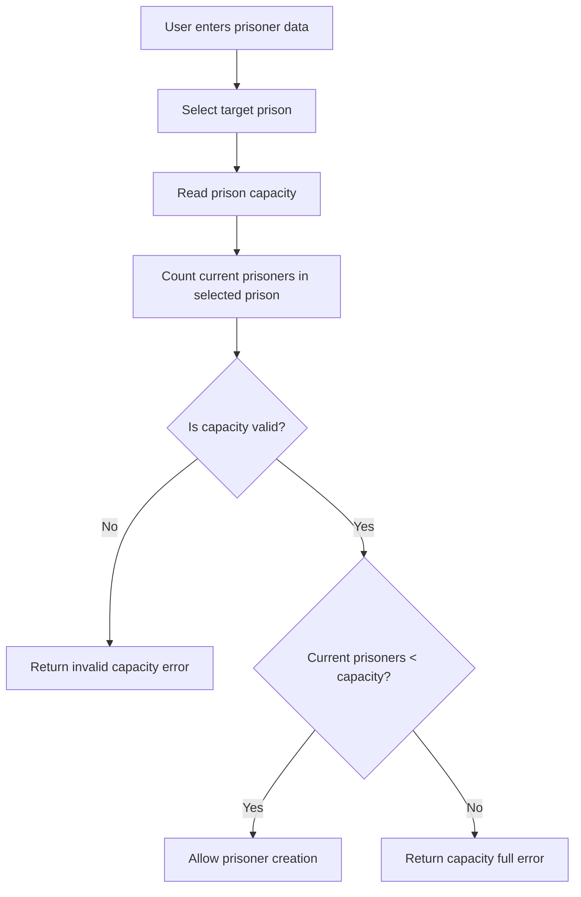
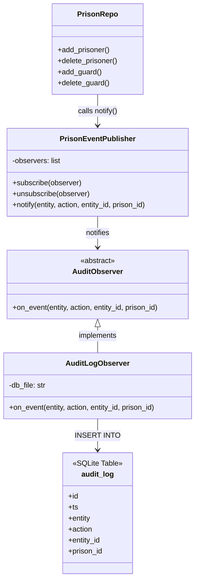

# Flow: Prison Capacity Validation

```mermaid
flowchart TD
    A[User enters prisoner data] --> B[Select target prison]
    B --> C[Read prison capacity]
    C --> D[Count current prisoners in selected prison]
    D --> E{Is capacity valid?}
    E -- No --> F[Return invalid capacity error]
    E -- Yes --> G{Current prisoners < capacity?}
    G -- Yes --> H[Allow prisoner creation]
    G -- No --> I[Return capacity full error]
```

---

# Module Structure: Observer Pattern — Audit Module

```mermaid
classDiagram
    class AuditObserver {
        <<abstract>>
        +on_event(entity, action, entity_id, prison_id)
    }

    class AuditLogObserver {
        -db_file: str
        +on_event(entity, action, entity_id, prison_id)
    }

    class PrisonEventPublisher {
        -observers: list
        +subscribe(observer)
        +unsubscribe(observer)
        +notify(entity, action, entity_id, prison_id)
    }

    class PrisonRepo {
        +add_prisoner()
        +delete_prisoner()
        +add_guard()
        +delete_guard()
    }

    class audit_log {
        <<SQLite Table>>
        +id
        +ts
        +entity
        +action
        +entity_id
        +prison_id
    }

    AuditObserver <|-- AuditLogObserver : implements
    PrisonEventPublisher --> AuditObserver : notifies
    PrisonRepo --> PrisonEventPublisher : calls notify()
    AuditLogObserver --> audit_log : INSERT INTO
```
