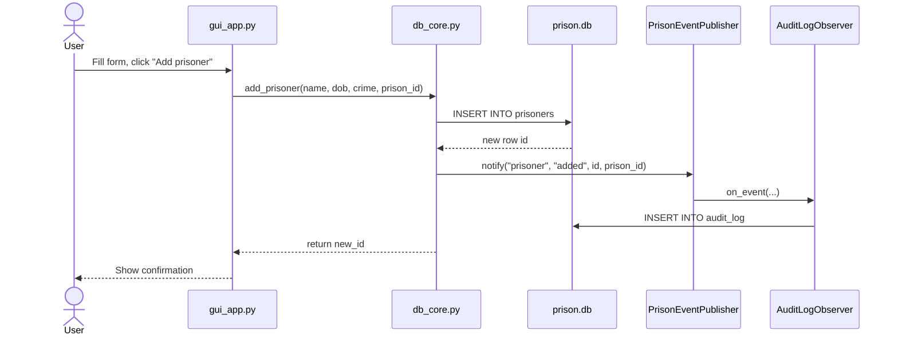

# System Architecture

## Overview

The Prison Management System is a desktop application built with Python, Tkinter, and SQLite. It follows a two-layer architecture: a GUI layer (`gui_app.py`) and a database layer (`db_core.py`), now extended with an event-driven audit module using the Observer pattern.

---

## Architecture Diagram

```mermaid
graph TD
    subgraph UI Layer
        GUI[gui_app.py\nTkinter Desktop App]
    end

    subgraph Data Layer
        REPO[db_core.py\nPrisonRepo]
        DB[(prison.db\nSQLite)]
    end

    subgraph Audit Module — Observer Pattern
        PUB[PrisonEventPublisher\nSubject]
        OBS[AuditLogObserver\nConcreteObserver]
        IOBS[AuditObserver\nAbstract Interface]
    end

    GUI -->|calls CRUD methods| REPO
    REPO -->|SQL INSERT / DELETE / SELECT| DB
    DB -->|SQL Triggers| DB
    REPO -->|notify on add/delete| PUB
    PUB -->|on_event| OBS
    OBS -->|INSERT INTO audit_log| DB
    OBS -.->|implements| IOBS

    style PUB fill:#f5a623,color:#000
    style OBS fill:#7ed321,color:#000
    style IOBS fill:#d0d0d0,color:#000
```

---

## Component Responsibilities

| Component | Responsibility |
|---|---|
| `gui_app.py` | All Tkinter UI: tabs, forms, treeviews, user interaction |
| `db_core.py` (`PrisonRepo`) | All SQLite operations: CRUD, validation, capacity checks |
| `prison.db` | Persistent storage: prisons, prisoners, guards, audit_log |
| `PrisonEventPublisher` | Holds observer list; fires `notify()` after state changes |
| `AuditLogObserver` | Reacts to events by writing rows to `audit_log` |
| `AuditObserver` | Abstract interface enabling future observers (e.g. email alerts) |

---

## Data Flow: Adding a Prisoner


