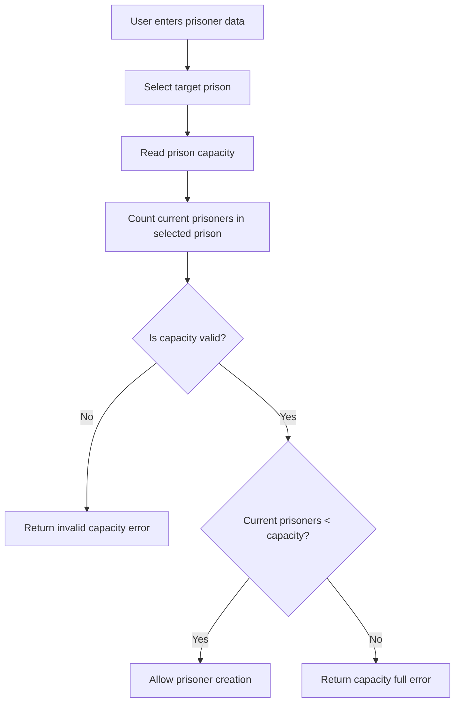

# Flow: Prison Capacity Validation

```mermaid
flowchart TD
    A[User enters prisoner data] --> B[Select target prison]
    B --> C[Read prison capacity]
    C --> D[Count current prisoners in selected prison]
    D --> E{Is capacity valid?}
    E -- No --> F[Return invalid capacity error]
    E -- Yes --> G{Current prisoners < capacity?}
    G -- Yes --> H[Allow prisoner creation]
    G -- No --> I[Return capacity full error]
```
